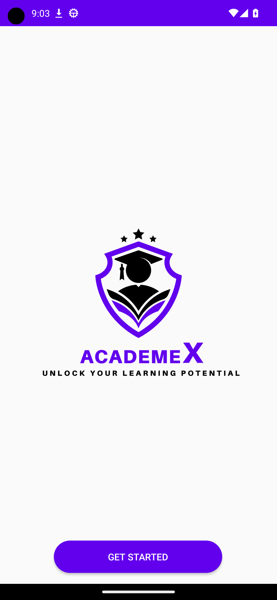
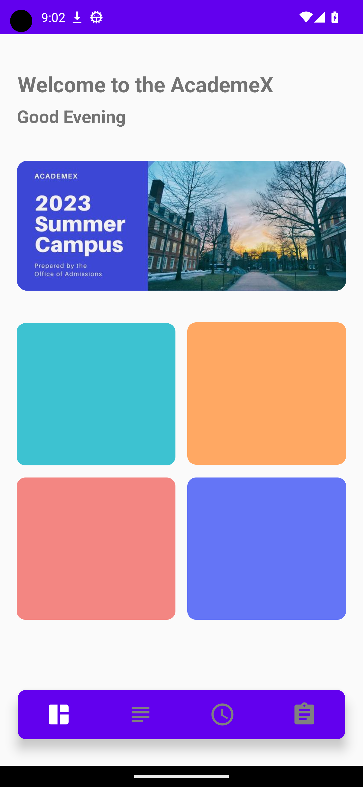
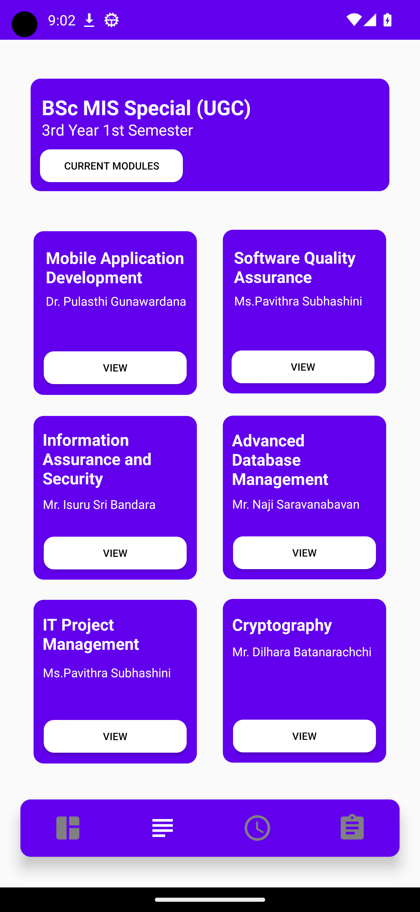
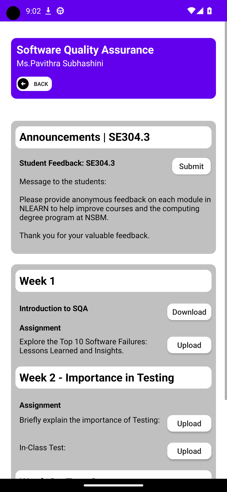
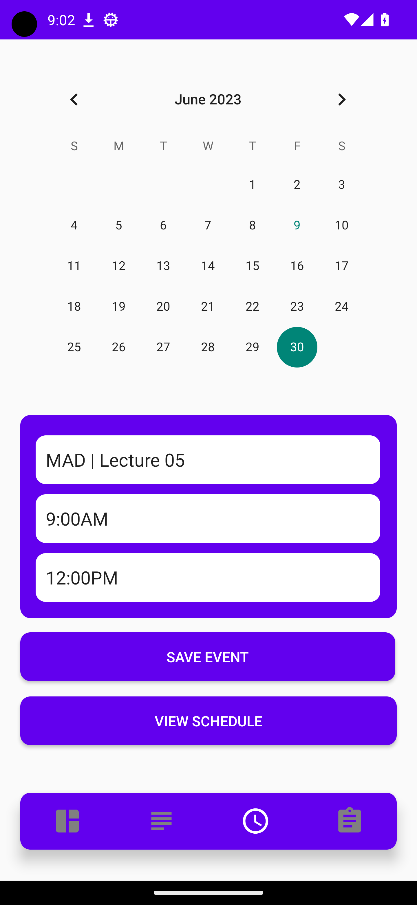
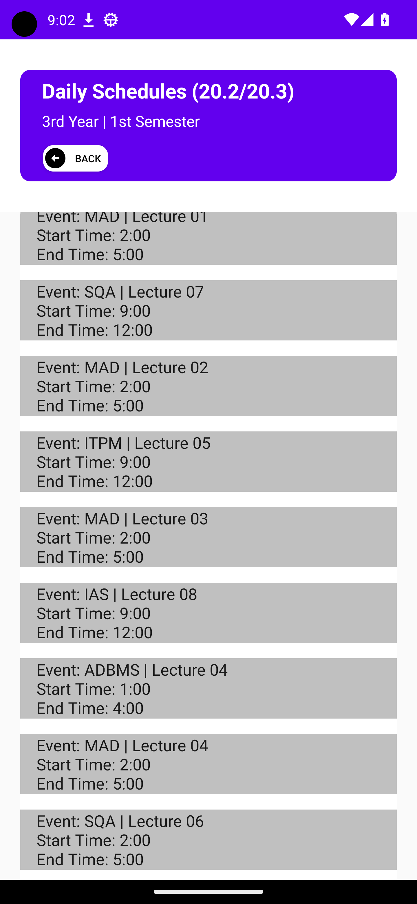
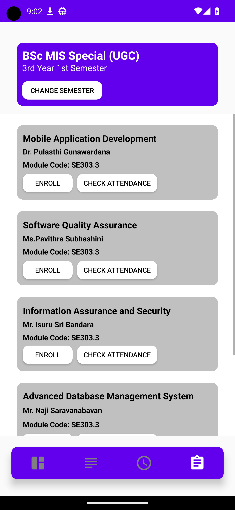

# AcademeX - Mobile Learning Management System

AcademeX is a Java-based mobile application developed to enhance the learning management experience in universities. This project aims to create a user-friendly and visually appealing application by incorporating essential elements such as page creation, graphics, buttons, and information architecture. It provides features that facilitate easy access to lecture materials, assignment submissions, and communication between students and lecturers.

## Features

- **Download Lecture Materials**: Lecturers can upload lecture materials, making them easily accessible for students to download and reference.
- **View Marks/Grade Student Assignments**: Students can view their marks or grades for the assignments they have submitted.
- **Lecture Schedules**: Lecturers can schedule lectures, allowing students to stay organized and prepared.
- **Assignment Upload**: Students can upload their assignments directly through the application.

## Technologies Used

This project utilizes the following technologies:

- 
- 
- 
- 

## Screenshots

| Screenshot 1                 | Screenshot 2                 | Screenshot 3                 | 
| ---------------------------- | ---------------------------- | ---------------------------- | 
|  |  |  
| *Caption for Screenshot 1*   | *Caption for Screenshot 2*   | *Caption for Screenshot 3*   |

| Screenshot 4                 | Screenshot 5                 | Screenshot 6                 |
| ---------------------------- | ---------------------------- | ---------------------------- |
|  |  | 
| *Caption for Screenshot 4*   | *Caption for Screenshot 5*   | *Caption for Screenshot 6*   |

| Screenshot 7                 | Screenshot 8                 | Screenshot 9                 |
| ---------------------------- | ---------------------------- | ---------------------------- |
|  |  | 
| *Caption for Screenshot 7*   | *Caption for Screenshot 8*   | *Caption for Screenshot 9*   |

## License
This project is licensed under the MIT License.
